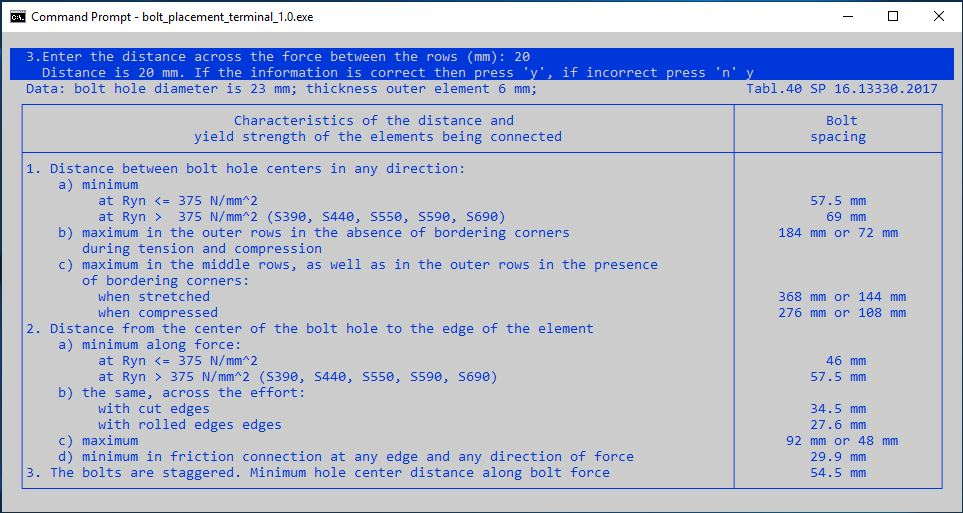

# Многомодульная программа 
### Консольное приложение "Размещение болтов в стальных конструкциях"

Цель разработки: реализация требований табл. 40 СП 16.13330ю2017.

Данное приложение имеет текстовый интерфейс пользователя. Такая возможность, при разработке в Windows, предоставляется библиотекой управления терминалом **curses.h**.

(<a href="#readme-top">вверх</a>)
